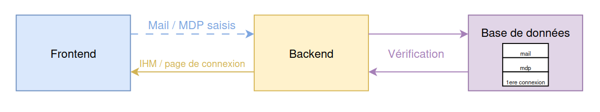
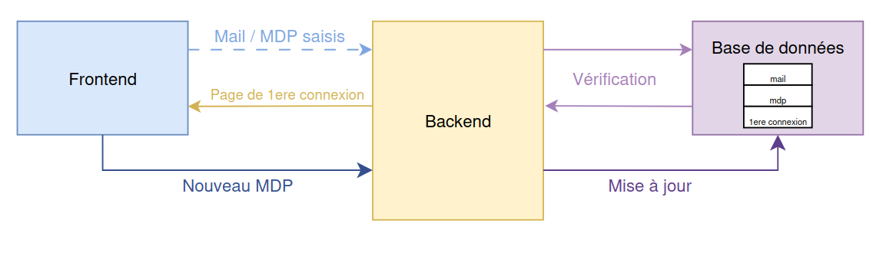
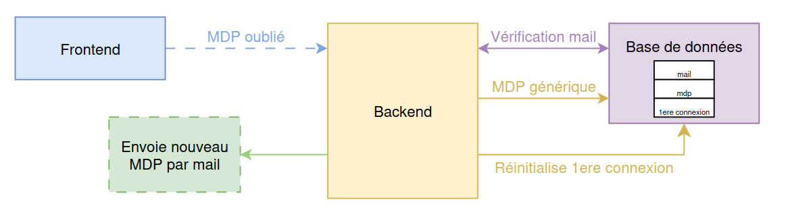

# projet-genilog-is
Projet concernant les travaux pratiques pour le sujet de Génie Logiciel de la formation en Informatique et Systèmes à l'ENSEA.

## Résumé du travail

Le projet proposé pour le TP est le développement du logiciel WebReport, qui vise à remplacer un processus manuel de suivi de temps et de budget dans une PME d’imprimerie par une solution numérique centralisée.
L’objectif est de fournir une interface web simple et intuitive permettant aux employés et responsables de saisir et consulter les informations sans ressaisie inutile ni délais de traitement liés au papier.

## Résumé du cas d’étude

Problème actuel : suivi manuel (papier) -> perte de temps, ressaisies, erreurs, manque de visibilité rapide.

Solution visée : application web multi-accès (via navigateur) pour gérer les projets, lots et activités avec contrôle des droits utilisateurs.

Contrainte technique : parc informatique hétérogène (Linux, Windows, Android).

Utilisateur final : tous les employés (saisies périodiques), responsables métiers, responsables de projet, superviseur.

## Structure de travail (organisation de l’équipe)

La réalisation du projet est organisée autour de trois pôles principaux :

###  Frontend (IHM Web)
Responsable : Julien METZELARD

Membres: Yosra GUESMI, Sébastien NOUIRA-HUET

Développement des écrans de connexion, gestion des erreurs, expérience utilisateur.

### Backend (API & logique métier)
Responsable : Maël ARCHENAULT

Membres: Maël LUKAS

Gestion des requêtes, sécurité (authentification, validation), communication avec la base.

### Base de Données (modèle & persistance)
Responsable : Léo BOUTONNET

Membres: Nathan GROUSSARD, Tarek TALSI

Définition du schéma relationnel (Utilisateurs, Projets, Lots, Activités), mise en place des contraintes d’intégrité.

En parallèle :

### Équipe de gestion / pilotage projet
Responsable : Justine HAZAN

Chef adjoint: Théo CRUZ DE ABREU FARIAS

 Suivi de l’avancement, validation des livrables, communication avec le client.

## Versions livrables

Afin d'avoir un travail plus organisé, notre groupe a divisé le travail en jalons pour un produit livrable avec moins de ressources (MVP) qui sera enrichi de façon incrémentale.

### Premier livrable (v1.0.0)

La version v1.0.0 se limite au module de connexion utilisateur :

- Écran de login classique (email + mot de passe).

- Gestion de la première connexion (l'utilisateur commence avec un mot de passe générique reçu de la direction informatique puis doit le changer obligatoirement).

- Réinitialisation de mot de passe (avec code de vérification par email).

- Gestion des erreurs de connexion (mauvais mot de passe, confirmation incorrecte, etc.).

### Base de Données

Afin d'avoir la fonctionnalité de base pour le jalon défini, l'équipe base de données a défini l'entité principale (Utilisateur) avec les attributs suivants:

   Attribut            | Type          | Description                                      |
 |---------------------|---------------|--------------------------------------------------|
 | id                  | int           | Identifiant unique de l'utilisateur.            |
 | super user          | bool          | Indique si l'utilisateur a des droits étendus. |
 | nom                 | string        | Nom de l'utilisateur.                           |
 | prénom              | string        | Prénom de l'utilisateur.                        |
 | id_metier           | int           | Identifiant du métier de l'utilisateur.         |
 | password_hashed     | string        | Mot de passe haché de l'utilisateur.             |
 | email               | string        | Adresse e-mail de l'utilisateur.                 |
 | 1ere_connexion      | bool          | Indique si c'est la première connexion.          |
 | matricule           |string         | Matricule de l'utilisateur utilisé pour se connecter|

Cette entité a des relations prévues avec autres nécessaires pour la partie de management de projet: Projet, Lot, Activité (envisagées mais non exploitées dans la version v1.0.0).

### Frontend

Pour la section frontend, l'équipe a implémenté un scénario général avec les éléments suivants et les interactions utilisateur qui provoqueront les changements d'état/réactions du système :

- Page de connexion (login/password).

- Page de première connexion (saisie d’un nouveau mot de passe).

- Page de réinitialisation de mot de passe (avec code envoyé par email).

- Pages d’erreurs (mot de passe incorrect, confirmation invalide, etc.).

On a aussi développé une organisation pour les écrans qui seront liés au scénario défini.

### Backend

Afin de donner le support nécessaire pour lier l'interface homme-machine et la base de données dans l'application, le backend a défini la structure suivante pour ses fonctions principales :

#### Fonctionnement général
De manière générale, le backend établit une connexion entre la base de données et le frontend. Il gère les requêtes, traite les données et renvoie les réponses appropriées. Le fonctionnement peut être résumé en ce diagramme:  

Le backend doit pouvoir recevoir des requêtes du frontend contennant des informations à traiter. Dialoguer avec la base de données pour vérifier ou stocker les données reçues et également envoyer des réponses au frontend, généralement sous forme de liens vers les différentes pages à afficher à l'utilisateur.  

Les sections suivantes détaillent les différents scenarios de connexion possibles, les relations entre le backend et les autres sections de l'application et les fonctions nécessaires pour chaque scénario.

#### Connexion classique à l'IHM
Dans un premier temps, le backend est chargé d'envoyé au frontend le lien vers la page de connexion à l'IHM. Ensuite le scénario de connexion classique est représenté ainsi:  

Le backend doit être capable de:
- Recevoir les identifiants de connexion (login et mot de passe) du frontend.
- Vérifier les identifiants en interrogeant la base de données.
- Envoyer au frontend le lien vers la page d'accueil si les identifiants sont corrects.
- Envoyer au frontend un message d'erreur et la page de connexion de nouveau si les identifiants sont incorrects.

#### Cas de la première connexion
Lors de la première connexion l'utilisateur fournis un mot de passe générique et sera invité à le changer juste après s'être connecté. Le scenario est le suivant:  

Le backend doit être capable de:
- Recevoir les identifiants de connexion (login et mot de passe) du frontend.
- Vérifier les identifiants et le booléen de première connexion en interrogeant la base de données.
- Envoyer au frontend le lien vers la page de changement de mot de passe si les identifiants sont corrects et que c'est la première connexion.
- Recevoir le nouveau mot de passe du frontend.
- Mettre à jour le mot de passe et le booléen de première connexion dans la base de données.

#### Cas d'un mot de passe oublié
Lorsqu'un utilisateur oublie son mot de passe, il peut demander à le réinitialiser avec un bouton prévu sur la page de connexion. Le scenario est alors le suivant:

Le backend doit être capable de:
- Recevoir la demande de réinitialisation et l'email utilisateur du frontend.
- Vérifier que l'email est bien associé à un compte utilisateur en interrogeant la base de données.
- Générer un code de vérification et l'envoyer par mail.
- Envoyer au frontend la page de saisie du code de vérification.
- Recevoir le code de vérification saisi par l'utilisateur.
- Vérifier que le code de vérification est correct.
- Envoyer au frontend la page de saisie du nouveau mot de passe.
- Recevoir le nouveau mot de passe saisi par l'utilisateur.
- Mettre à jour le mot de passe dans la base de données avec le nouveau mot de passe.
- Envoyer au frontend un message de confirmation que le mot de passe a été changé.

#### Détail des fonctions
un tableau récapitulatif des fonctions nécessaires pour chaque scénario a également été préparé:
| Scénario                     | Fonction                                 | Description                                                                                   |
|------------------------------|------------------------------------------|-----------------------------------------------------------------------------------------------|
|Connexion classique| `verify_credentials(serial_number,pwd)`                     | Vérifier les identifiants en interrogeant la base de données.         |
|MDP oublié|`send_verification_code(email)` | Générer un code de vérification et l'envoyer par mail. |
|MDP oublié| `verify_code(input_code)` | Vérifier que le code de vérification est correct. |
|1ere connexion / MDP oublié| `check_password_validity(entry1, entry2)` | Vérifier que les champs mot de passe sont égaux et que les règles de création de mot de passe sont respectées. |
|1ere connexion / MDP oublié| `hash_password(pwd)` | Hasher le mot de passe avant de le stocker dans la base de données. |
|Database related|`get_user_by_serial(serial_number)`                     | Récupérer les informations de l'utilisateur par son numéro de série.         |
|Database related|`update_user(user)`                     | Mettre à jour les différents champs utilisateurs dans la base de données.         |

## Prochaines étapes (au-delà de v1.0.0)

- Déploiement des modules Projet / Lot / Activité.

- Mise en place des écrans de saisie périodique.

- Tableau de bord pour les responsables.

- Gestion des validations et rapports.
