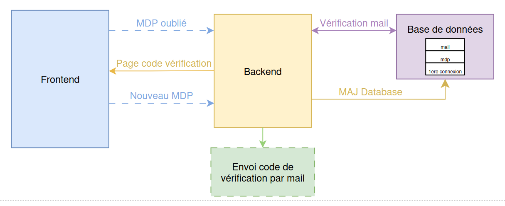

# Fonctions backend
Ce document décrit les fonctions principales de la partie backend de l'application.

## Fonctionnement général
De manière générale, le backend établit une connexion entre la base de données et le frontend. Il gère les requêtes, traite les données et renvoie les réponses appropriées. Le fonctionnement peut être résumé en ce diagramme:  

Le backend doit pouvoir recevoir des requêtes du frontend contennant des informations à traiter. Dialoguer avec la base de données pour vérifier ou stocker les données reçues et également envoyer des réponses au frontend, généralement sous formes de liens vers les différents pages à afficher à l'utilisateur.  

Les sections suivantes détaillent les différents scenarios de connexion possibles, les relations entre le backend et les autres sections de l'application et les fonctions nécessaires pour chaque scénario.

## Connexion classique à l'IHM
Dans un premier temps, le backend est chargé d'envoyé au frontend le lien vers la page de connexion à l'IHM. Ensuite le scenario de connexion classsique est représenté ainsi:  

Le backend doit être capable de:
- Recevoir les identifiants de connexion (login et mot de passe) du frontend.
- Vérifier les identifiants en interrogeant la base de données.
- Envoyer au frontend le lien vers la page d'accueil si les identifiants sont corrects.
- Envoyer au frontend un message d'erreur et la page de connexion de nouveau si les identifiants sont incorrects.

## Cas de la première connexion
Lors de la première connexion l'utilisateur fournis un mot de passe générique et sera invvité à le changer juste après s'être connecté. Le scenario est le suivant:  

Le backend doit être capable de:
- Recevoir les identifiants de connexion (login et mot de passe) du frontend.
- Vérifier les identifiants et le booléen de première connexion en interrogeant la base de données.
- Envoyer au frontend le lien vers la page de changement de mot de passe si les identifiants sont corrects et que c'est la première connexion.
- Recevoir le nouveau mot de passe du frontend.
- Mettre à jour le mot de passe et le booléen de première connexion dans la base de données.

## Cas d'un mot de passe oublié
Lorsqu'un utilisateur oublie son mot de passe, il peut demander à le réinitialiser avec un bouton prévu sur la page de connexion. Le scenario est alors le suivant:

Le backend doit être capable de:
- Recevoir la demande de réinitialisation et l'email utilisateur du frontend.
- Vérifier que l'email est bien associé à un compte utilisateur en interrogeant la base de données.
- Générer un code de vérification et l'envoyer par mail.
- Envoyer au frontend la page de saisie du code de vérification.
- Recevoir le code de vérification saisi par l'utilisateur.
- Vérifier que le code de vérification est correct.
- Envoyer au frontend la page de saisie du nouveau mot de passe.
- Recevoir le nouveau mot de passe saisi par l'utilisateur.
- Mettre à jour le mot de passe dans la base de données avec le nouveau mot de passe.
- Envoyer au frontend un message de confirmation que le mot de passe a été changé.

## Détail des fonctions
Voici un tableau récapitulatif des fonctions nécessaires pour chaque scénario:
| Scénario                     | Fonction                                 | Description                                                                                   |
|------------------------------|------------------------------------------|-----------------------------------------------------------------------------------------------|
|Connexion classique| `verify_credentials(serial_number,pwd)`                     | Vérifier les identifiants en interrogeant la base de données.         |
|MDP oublié|`send_verification_code(email)` | Générer un code de vérification et l'envoyer par mail. |
|MDP oublié| `verify_code(input_code)` | Vérifier que le code de vérification est correct. |
|1ere connexion / MDP oublié| `check_password_validity(entry1, entry2)` | Vérifier que les champs mot de passe sont égaux et que les règles de création de mot de passe sont respectées. |
|1ere connexion / MDP oublié| `hash_password(pwd)` | Hasher le mot de passe avant de le stocker dans la base de données. |
|Database related|`get_user_by_serial(serial_number)`                     | Récupérer les informations de l'utilisateur par son numéro de série.         |
|Database related|`update_user(user)`                     | Mettre à jour les différents champs utilisateurs dans la base de données.         |

