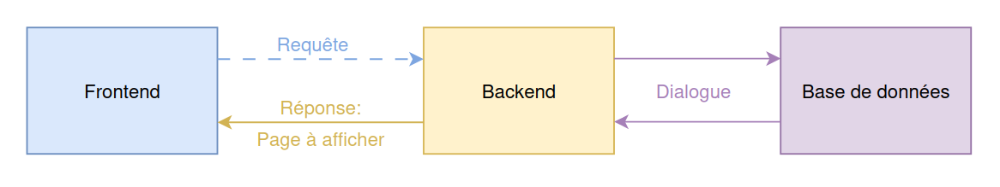
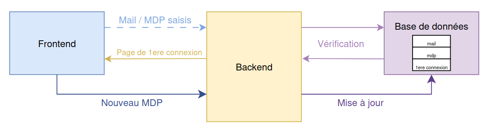

# Fonctions backend
Le document suivant décrit les fonctions principales du serveur backend afin d'assurer le bon fonctionnement de l'application et ses fonctionnalités, à l'état d'avancement 1.0.0.

## Fonctionnement général
De manière générale, le backend établit une connexion entre la base de données et le frontend. Il gère les requêtes, traite les données et renvoie les réponses appropriées. Le fonctionnement peut être résumé en ce diagramme:  

Le backend doit pouvoir recevoir des requêtes du frontend contennant des informations à traiter. Dialoguer avec la base de données pour vérifier ou stocker les données reçues et également envoyer des réponses au frontend, généralement sous formes de liens vers les différents pages à afficher à l'utilisateur.  

Les sections suivantes détaillent les différents scenarios de connexion possibles, les relations entre le backend et les autres sections de l'application et les fonctions nécessaires pour chaque scénario.

## Connexion classique à l'IHM
Dans un premier temps, le backend est chargé d'envoyé au frontend le lien vers la page de connexion à l'IHM. Ensuite le scenario de connexion classsique est représenté ainsi:  

Le backend doit être capable de:
- Recevoir les identifiants de connexion (login et mot de passe) du frontend.
- Vérifier les identifiants en interrogeant la base de données.
- Envoyer au frontend le lien vers la page d'accueil si les identifiants sont corrects.
- Envoyer au frontend un message d'erreur et la page de connexion de nouveau si les identifiants sont incorrects.

## Cas de la première connexion
Lors de la première connexion l'utilisateur fournis un mot de passe générique et sera invvité à le changer juste après s'être connecté. Le scenario est le suivant:  

Le backend doit être capable de:
- Recevoir les identifiants de connexion (login et mot de passe) du frontend.
- Vérifier les identifiants et le booléen de première connexion en interrogeant la base de données.
- Envoyer au frontend le lien vers la page de changement de mot de passe si les identifiants sont corrects et que c'est la première connexion.
- Recevoir le nouveau mot de passe du frontend.
- Mettre à jour le mot de passe et le booléen de première connexion dans la base de données.

## Cas d'un mot de passe oublié
Lorsqu'un utilisateur oublie son mot de passe, il peut demander à le réinitialiser avec un bouton prévu sur la page de connexion. Le scenario est alors le suivant:

Le backend doit être capable de:
- Recevoir la demande de réinitialisation et l'email utilisateur du frontend.
- Vérifier que l'email est bien associé à un compte utilisateur en interrogeant la base de données.
- Générer un code de vérification et l'envoyer par mail.
- Envoyer au frontend la page de saisie du code de vérification.
- Recevoir le code de vérification saisi par l'utilisateur.
- Vérifier que le code de vérification est correct.
- Envoyer au frontend la page de saisie du nouveau mot de passe.
- Recevoir le nouveau mot de passe saisi par l'utilisateur.
- Mettre à jour le mot de passe dans la base de données avec le nouveau mot de passe.
- Envoyer au frontend un message de confirmation que le mot de passe a été changé.

## Fonctions à appeler depuis le front-end

### Page de connexion
| Bouton                     | Fonction                                 | Description                                                                                   |
|------------------------------|------------------------------------------|-----------------------------------------------------------------------------------------------|
|Submit| `connect(serial_number,password)`                     | Vérifier les identifiants en interrogeant la base de données. Redirige vers la page principale si les vérifications sont bonnes. Message d'erreur sinon.|
|MDP oublié|`forgotten_password()` | Redirige l'utilisateur vers la page de mot de passe oublié|

### Page de récupération de mot de passe

| Bouton                     | Fonction                                 | Description                                                                                   |
|------------------------------|------------------------------------------|-----------------------------------------------------------------------------------------------|
|Submit| `send_serial_for_password_reset(serial_number)`                     | Envoie un mail à l'adresse associée au matricule dans la base de donnée. Message d'erreur, si le matricule n'est pas trouvé. Sinon redirige vers la page de Saisie de code de vérification         |

### Page de Saisie de code de vérification

| Bouton                     | Fonction                                 | Description                                                                                   |
|------------------------------|------------------------------------------|-----------------------------------------------------------------------------------------------|
|Submit| `send_verification_code(verification_code)`                     | Vérifie que le code de vérification est le bon. Redirige vers la page de modification de mot de passe si c'est le cas. Message d'erreur sinon.        |

### Page de modification de mot de passe

| Bouton                     | Fonction                                 | Description                                                                                   |
|------------------------------|------------------------------------------|-----------------------------------------------------------------------------------------------|
|Submit| `modify_password(password1, password2)`                     | Verifie la validité des deux entrées. Si les deux mots de passe sont valide, le mot de passe est changé dans le base de donnée. Message d'erreur sinon|
